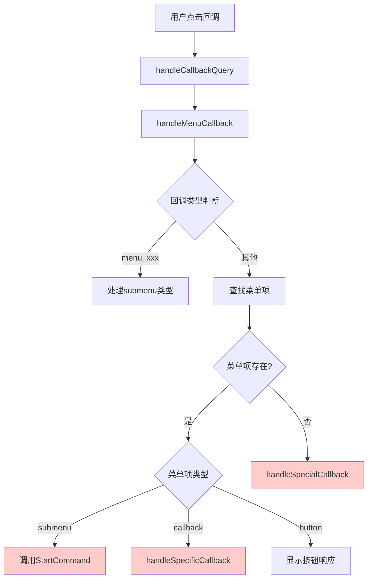
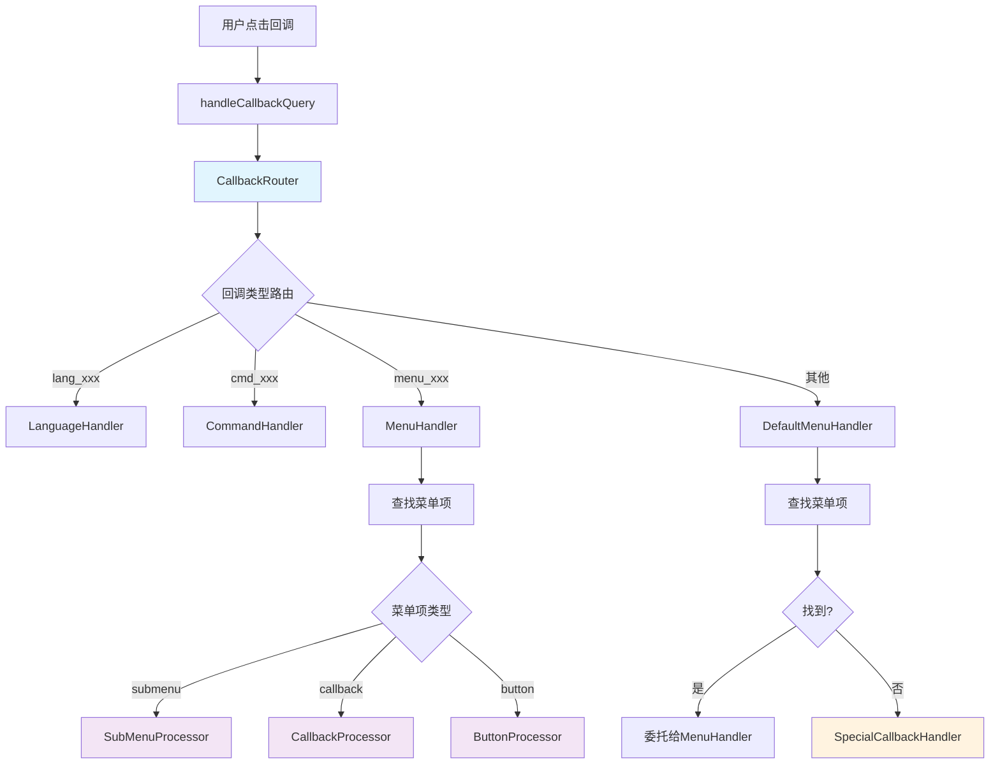

# Telegram回调处理架构分析与重构方案

## 1. 问题概述

当前TelegramMessageService中存在多个回调处理方法，导致逻辑复杂、重复处理和难以维护的问题。主要表现为：

- `welcome_message`回调被多个方法重复处理
- 回调处理逻辑分散在多个方法中
- 代码执行路径不清晰，难以调试
- 容易产生意外的副作用

## 2. 当前架构问题分析

### 2.1 现有回调处理方法

当前TelegramMessageService中存在以下回调处理方法：

1. **handleMenuCallback()** - 主要回调处理入口
2. **handleSpecificCallback()** - 处理特定菜单项回调
3. **handleSpecialCallback()** - 处理特殊回调（非菜单项）

### 2.2 问题根源分析



**核心问题：**

1. **重复处理路径**：`welcome_message`可能同时被`handleMenuCallback`和`handleSpecialCallback`处理
2. **逻辑分散**：回调处理逻辑分布在3个不同方法中
3. **职责不清**：每个方法的职责边界模糊
4. **难以扩展**：添加新的回调类型需要修改多个地方

### 2.3 具体问题案例

以`welcome_message`回调为例：

```php
// 在handleMenuCallback中
if (str_starts_with($data, 'menu_')) {
    // 处理menu_xxx格式
    $this->startCommand->execute($user, ['callback_data' => $data], $menuItem->id);
}

// 查找菜单项
$menuItem = TelegramMenuItem::where('callback_data', $data)->first();
if ($menuItem) {
    switch ($menuItem->type) {
        case 'submenu':
            $this->startCommand->execute($user, ['callback_data' => $data], $menuItem->id);
            break;
        case 'callback':
            $this->handleSpecificCallback($user, $data, $menuItem, $callbackQueryId);
            break;
    }
    return; // 关键：这里返回，避免进入handleSpecialCallback
}

// 如果没有找到菜单项，才进入特殊处理
$this->handleSpecialCallback($user, $data, $callbackQueryId);
```

**问题：**
- 如果`welcome_message`既存在于数据库中，又在`handleSpecialCallback`中有特殊处理，可能产生冲突
- 代码执行路径依赖于数据库查询结果，不够可预测

## 3. 重构方案

### 3.1 设计原则

1. **单一职责**：每个方法只负责一种类型的回调处理
2. **清晰的执行路径**：回调处理流程应该是线性和可预测的
3. **易于扩展**：新增回调类型应该只需要在一个地方修改
4. **避免重复**：每个回调只应该被处理一次

### 3.2 推荐架构



### 3.3 重构后的代码结构

```php
class TelegramMessageService
{
    public function handleCallbackQuery(TelegramUser $user, string $data, int $messageId, string $callbackQueryId): void
    {
        try {
            $router = new CallbackRouter($this->languageService, $this->menuService, $this->startCommand);
            $result = $router->route($user, $data, $messageId, $callbackQueryId);
            
            if (!$result) {
                $this->answerCallbackQuery($callbackQueryId, '未知操作');
            }
        } catch (\Exception $e) {
            Log::error('Callback query handling failed', [
                'user_id' => $user->id,
                'data' => $data,
                'error' => $e->getMessage()
            ]);
            $this->answerCallbackQuery($callbackQueryId, '处理失败');
        }
    }
}

class CallbackRouter
{
    public function route(TelegramUser $user, string $data, int $messageId, string $callbackQueryId): bool
    {
        // 语言选择
        if (str_starts_with($data, 'lang_')) {
            return $this->handleLanguageCallback($user, $data, $callbackQueryId);
        }
        
        // 命令回调
        if (str_starts_with($data, 'cmd_')) {
            return $this->handleCommandCallback($user, $data, $messageId, $callbackQueryId);
        }
        
        // 菜单回调（优先处理格式化的菜单回调）
        if (str_starts_with($data, 'menu_')) {
            return $this->handleFormattedMenuCallback($user, $data, $callbackQueryId);
        }
        
        // 默认菜单处理（查找数据库中的菜单项）
        return $this->handleDefaultMenuCallback($user, $data, $callbackQueryId);
    }
    
    private function handleDefaultMenuCallback(TelegramUser $user, string $data, string $callbackQueryId): bool
    {
        $menuItem = TelegramMenuItem::where('callback_data', $data)
            ->orWhere('key', $data)
            ->active()
            ->first();
            
        if ($menuItem) {
            return $this->processMenuItemCallback($user, $menuItem, $data, $callbackQueryId);
        }
        
        // 如果不是菜单项，尝试特殊回调处理
        return $this->handleSpecialCallback($user, $data, $callbackQueryId);
    }
    
    private function processMenuItemCallback(TelegramUser $user, TelegramMenuItem $menuItem, string $data, string $callbackQueryId): bool
    {
        switch ($menuItem->type) {
            case 'submenu':
                $this->startCommand->execute($user, ['callback_data' => $data], $menuItem->id);
                $this->answerCallbackQuery($callbackQueryId);
                break;
                
            case 'callback':
                $this->processCallbackAction($user, $menuItem, $callbackQueryId);
                break;
                
            case 'button':
                $this->processButtonAction($user, $menuItem, $callbackQueryId);
                break;
                
            default:
                $this->answerCallbackQuery($callbackQueryId, '操作已执行');
                break;
        }
        
        // 记录统计
        $this->menuService->recordMenuStat($menuItem->id, $user->id, 'click');
        return true;
    }
}
```

## 4. 重构实施计划

### 4.1 第一阶段：创建新的回调路由器

1. 创建`CallbackRouter`类
2. 实现基本的路由逻辑
3. 保持与现有代码的兼容性

### 4.2 第二阶段：迁移现有逻辑

1. 将`handleMenuCallback`中的逻辑迁移到路由器
2. 简化`handleSpecificCallback`和`handleSpecialCallback`
3. 确保所有测试通过

### 4.3 第三阶段：清理和优化

1. 删除冗余的方法
2. 优化代码结构
3. 添加完整的测试覆盖

## 5. 预期收益

### 5.1 代码质量提升

- **可维护性**：逻辑集中，易于理解和修改
- **可测试性**：每个处理器可以独立测试
- **可扩展性**：新增回调类型只需要添加新的处理器

### 5.2 问题解决

- **消除重复处理**：每个回调只会被处理一次
- **清晰的执行路径**：代码执行流程可预测
- **更好的错误处理**：集中的错误处理逻辑

### 5.3 性能优化

- **减少数据库查询**：避免重复查询菜单项
- **更快的路由**：基于前缀的快速路由
- **更好的缓存策略**：可以在路由器级别实现缓存

## 6. 风险评估

### 6.1 潜在风险

1. **重构过程中的回归**：可能影响现有功能
2. **测试覆盖不足**：可能遗漏边缘情况
3. **性能影响**：新架构可能引入性能开销

### 6.2 风险缓解

1. **渐进式重构**：分阶段实施，保持向后兼容
2. **完整测试**：在重构前后进行全面测试
3. **性能监控**：监控重构前后的性能指标

## 7. 结论

当前的回调处理架构确实存在设计问题，导致代码复杂、难以维护。通过引入回调路由器模式，可以显著改善代码结构，提高可维护性和可扩展性。建议按照上述计划进行渐进式重构，确保系统稳定性的同时改善代码质量。