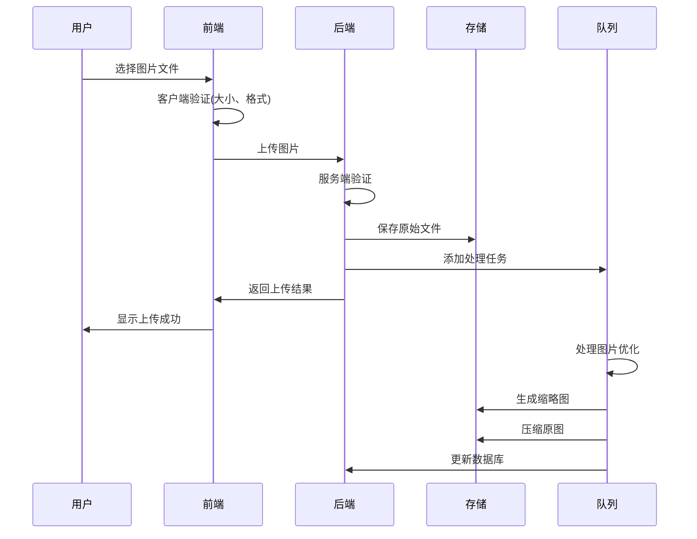
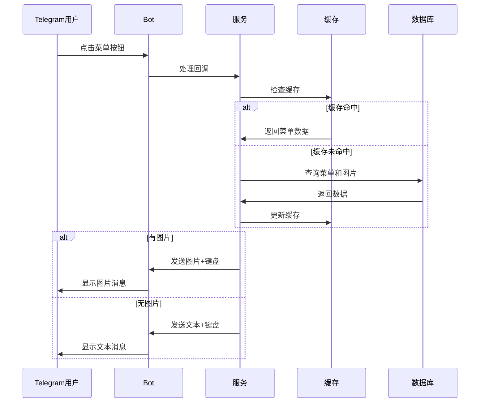

# Telegram 动态键盘菜单管理系统 - 技术设计文档

## 1. 系统架构概述

### 1.1 整体架构
```
┌─────────────────┐    ┌─────────────────┐    ┌─────────────────┐
│   前端 (React)   │    │  后端 (Laravel)  │    │  Telegram Bot   │
│                 │    │                 │    │                 │
│ - 管理界面      │◄──►│ - API 接口      │◄──►│ - 消息处理      │
│ - 图片上传      │    │ - 业务逻辑      │    │ - 回调处理      │
│ - 实时预览      │    │ - 数据存储      │    │ - 图片发送      │
└─────────────────┘    └─────────────────┘    └─────────────────┘
           │                       │                       │
           │                       │                       │
           ▼                       ▼                       ▼
┌─────────────────┐    ┌─────────────────┐    ┌─────────────────┐
│   文件存储       │    │   MySQL 数据库   │    │  Redis 缓存     │
│                 │    │                 │    │                 │
│ - 图片文件      │    │ - 菜单配置      │    │ - 会话数据      │
│ - 缩略图        │    │ - 用户数据      │    │ - 图片缓存      │
│ - 临时文件      │    │ - 统计数据      │    │ - API 缓存      │
└─────────────────┘    └─────────────────┘    └─────────────────┘
```

### 1.2 技术栈
- **前端**: React 18 + TypeScript + Tailwind CSS + Inertia.js
- **后端**: Laravel 10 + PHP 8.1+
- **数据库**: MySQL 8.0+
- **缓存**: Redis 6.0+
- **文件存储**: Laravel Storage (本地/云存储)
- **图片处理**: Intervention Image
- **队列**: Laravel Queue + Redis

## 2. 数据库设计

### 2.1 核心表结构

#### telegram_menu_items (菜单项表)
```sql
CREATE TABLE telegram_menu_items (
    id BIGINT UNSIGNED AUTO_INCREMENT PRIMARY KEY,
    parent_id BIGINT UNSIGNED NULL,
    command_key VARCHAR(100) NOT NULL,
    menu_type ENUM('command', 'submenu', 'link', 'text') DEFAULT 'command',
    action_type ENUM('callback', 'command', 'url') DEFAULT 'callback',
    action_value TEXT NULL,
    sort_order INT DEFAULT 0,
    is_active BOOLEAN DEFAULT TRUE,
    show_in_menu BOOLEAN DEFAULT TRUE,
    required_permissions JSON NULL,
    conditions JSON NULL,
    created_at TIMESTAMP DEFAULT CURRENT_TIMESTAMP,
    updated_at TIMESTAMP DEFAULT CURRENT_TIMESTAMP ON UPDATE CURRENT_TIMESTAMP,
    
    INDEX idx_parent_id (parent_id),
    INDEX idx_command_key (command_key),
    INDEX idx_sort_order (sort_order),
    INDEX idx_active_menu (is_active, show_in_menu),
    
    FOREIGN KEY (parent_id) REFERENCES telegram_menu_items(id) ON DELETE CASCADE
);
```

#### telegram_menu_translations (菜单翻译表)
```sql
CREATE TABLE telegram_menu_translations (
    id BIGINT UNSIGNED AUTO_INCREMENT PRIMARY KEY,
    menu_item_id BIGINT UNSIGNED NOT NULL,
    language_code VARCHAR(10) NOT NULL,
    title VARCHAR(255) NOT NULL,
    description TEXT NULL,
    button_text VARCHAR(100) NULL,
    created_at TIMESTAMP DEFAULT CURRENT_TIMESTAMP,
    updated_at TIMESTAMP DEFAULT CURRENT_TIMESTAMP ON UPDATE CURRENT_TIMESTAMP,
    
    UNIQUE KEY unique_menu_lang (menu_item_id, language_code),
    INDEX idx_language (language_code),
    
    FOREIGN KEY (menu_item_id) REFERENCES telegram_menu_items(id) ON DELETE CASCADE
);
```

#### telegram_menu_images (图片资源表)
```sql
CREATE TABLE telegram_menu_images (
    id BIGINT UNSIGNED AUTO_INCREMENT PRIMARY KEY,
    filename VARCHAR(255) NOT NULL,
    original_name VARCHAR(255) NOT NULL,
    file_path VARCHAR(500) NOT NULL,
    file_size INT UNSIGNED NOT NULL,
    mime_type VARCHAR(100) NOT NULL,
    width INT UNSIGNED NULL,
    height INT UNSIGNED NULL,
    thumbnail_path VARCHAR(500) NULL,
    alt_text VARCHAR(255) NULL,
    tags JSON NULL,
    upload_user_id BIGINT UNSIGNED NULL,
    usage_count INT DEFAULT 0,
    created_at TIMESTAMP DEFAULT CURRENT_TIMESTAMP,
    updated_at TIMESTAMP DEFAULT CURRENT_TIMESTAMP ON UPDATE CURRENT_TIMESTAMP,
    
    INDEX idx_filename (filename),
    INDEX idx_mime_type (mime_type),
    INDEX idx_upload_user (upload_user_id),
    INDEX idx_usage_count (usage_count)
);
```

#### telegram_menu_item_images (菜单项图片关联表)
```sql
CREATE TABLE telegram_menu_item_images (
    id BIGINT UNSIGNED AUTO_INCREMENT PRIMARY KEY,
    menu_item_id BIGINT UNSIGNED NOT NULL,
    image_id BIGINT UNSIGNED NOT NULL,
    language_code VARCHAR(10) DEFAULT 'default',
    image_type ENUM('main', 'thumbnail', 'background') DEFAULT 'main',
    sort_order INT DEFAULT 0,
    created_at TIMESTAMP DEFAULT CURRENT_TIMESTAMP,
    
    UNIQUE KEY unique_menu_image_lang (menu_item_id, image_id, language_code, image_type),
    INDEX idx_menu_item (menu_item_id),
    INDEX idx_image (image_id),
    INDEX idx_language (language_code),
    
    FOREIGN KEY (menu_item_id) REFERENCES telegram_menu_items(id) ON DELETE CASCADE,
    FOREIGN KEY (image_id) REFERENCES telegram_menu_images(id) ON DELETE CASCADE
);
```

#### telegram_languages (支持语言表)
```sql
CREATE TABLE telegram_languages (
    id BIGINT UNSIGNED AUTO_INCREMENT PRIMARY KEY,
    code VARCHAR(10) NOT NULL UNIQUE,
    name VARCHAR(100) NOT NULL,
    native_name VARCHAR(100) NOT NULL,
    flag_emoji VARCHAR(10) NULL,
    is_active BOOLEAN DEFAULT TRUE,
    is_default BOOLEAN DEFAULT FALSE,
    sort_order INT DEFAULT 0,
    created_at TIMESTAMP DEFAULT CURRENT_TIMESTAMP,
    updated_at TIMESTAMP DEFAULT CURRENT_TIMESTAMP ON UPDATE CURRENT_TIMESTAMP,
    
    INDEX idx_code (code),
    INDEX idx_active (is_active),
    INDEX idx_default (is_default)
);
```

#### telegram_menu_stats (使用统计表)
```sql
CREATE TABLE telegram_menu_stats (
    id BIGINT UNSIGNED AUTO_INCREMENT PRIMARY KEY,
    menu_item_id BIGINT UNSIGNED NOT NULL,
    user_id BIGINT NULL,
    language_code VARCHAR(10) NULL,
    action_type VARCHAR(50) NOT NULL,
    clicked_at TIMESTAMP DEFAULT CURRENT_TIMESTAMP,
    session_id VARCHAR(100) NULL,
    user_agent TEXT NULL,
    
    INDEX idx_menu_item (menu_item_id),
    INDEX idx_clicked_at (clicked_at),
    INDEX idx_language (language_code),
    INDEX idx_session (session_id),
    
    FOREIGN KEY (menu_item_id) REFERENCES telegram_menu_items(id) ON DELETE CASCADE
);
```

## 3. 后端架构设计

### 3.1 目录结构
```
app/
├── Http/
│   ├── Controllers/
│   │   ├── Admin/
│   │   │   ├── TelegramMenuController.php
│   │   │   ├── TelegramImageController.php
│   │   │   └── TelegramLanguageController.php
│   │   └── Api/
│   │       └── TelegramBotController.php
│   ├── Requests/
│   │   ├── MenuItemRequest.php
│   │   ├── ImageUploadRequest.php
│   │   └── LanguageRequest.php
│   └── Resources/
│       ├── MenuItemResource.php
│       ├── ImageResource.php
│       └── LanguageResource.php
├── Models/
│   ├── TelegramMenuItem.php
│   ├── TelegramMenuTranslation.php
│   ├── TelegramMenuImage.php
│   ├── TelegramMenuItemImage.php
│   ├── TelegramLanguage.php
│   └── TelegramMenuStat.php
├── Services/
│   ├── TelegramMenuService.php
│   ├── TelegramImageService.php
│   ├── TelegramLanguageService.php
│   └── TelegramBotService.php
├── Jobs/
│   ├── ProcessImageUpload.php
│   ├── GenerateImageThumbnail.php
│   └── OptimizeImage.php
├── Events/
│   ├── MenuItemCreated.php
│   ├── MenuItemUpdated.php
│   └── ImageUploaded.php
└── Listeners/
    ├── UpdateMenuCache.php
    ├── LogMenuActivity.php
    └── ProcessImageOptimization.php
```

### 3.2 核心服务类设计

#### TelegramMenuService
```php
<?php

namespace App\Services;

class TelegramMenuService
{
    public function getMenuStructure(string $languageCode = 'en'): array
    {
        // 获取菜单结构，支持缓存
    }
    
    public function createMenuItem(array $data): TelegramMenuItem
    {
        // 创建菜单项
    }
    
    public function updateMenuItem(int $id, array $data): TelegramMenuItem
    {
        // 更新菜单项
    }
    
    public function deleteMenuItem(int $id): bool
    {
        // 删除菜单项
    }
    
    public function reorderMenuItems(array $items): bool
    {
        // 重新排序菜单项
    }
    
    public function getMenuWithImages(int $menuItemId, string $languageCode): array
    {
        // 获取带图片的菜单项
    }
}
```

#### TelegramImageService
```php
<?php

namespace App\Services;

class TelegramImageService
{
    public function uploadImage(UploadedFile $file, array $options = []): TelegramMenuImage
    {
        // 上传图片并处理
    }
    
    public function generateThumbnail(TelegramMenuImage $image): string
    {
        // 生成缩略图
    }
    
    public function optimizeImage(TelegramMenuImage $image): bool
    {
        // 优化图片
    }
    
    public function deleteImage(int $imageId): bool
    {
        // 删除图片
    }
    
    public function attachImageToMenuItem(int $menuItemId, int $imageId, string $languageCode): bool
    {
        // 关联图片到菜单项
    }
    
    public function getImagesByMenuItem(int $menuItemId, string $languageCode = null): Collection
    {
        // 获取菜单项的图片
    }
}
```

#### TelegramBotService
```php
<?php

namespace App\Services;

class TelegramBotService
{
    public function sendMenuWithImage(int $chatId, int $menuItemId, string $languageCode): bool
    {
        // 发送带图片的菜单
    }
    
    public function sendTextMenu(int $chatId, int $menuItemId, string $languageCode): bool
    {
        // 发送纯文本菜单
    }
    
    public function handleCallback(string $callbackData, int $chatId, string $languageCode): bool
    {
        // 处理回调
    }
    
    public function buildKeyboard(array $menuItems): array
    {
        // 构建键盘
    }
}
```

## 4. 前端架构设计

### 4.1 组件结构
```
resources/js/
├── Pages/
│   ├── Admin/
│   │   ├── TelegramMenu/
│   │   │   ├── Index.tsx
│   │   │   ├── Create.tsx
│   │   │   ├── Edit.tsx
│   │   │   └── Preview.tsx
│   │   ├── TelegramImages/
│   │   │   ├── Index.tsx
│   │   │   ├── Upload.tsx
│   │   │   └── Gallery.tsx
│   │   └── TelegramLanguages/
│   │       ├── Index.tsx
│   │       └── Manage.tsx
├── Components/
│   ├── TelegramMenu/
│   │   ├── MenuTree.tsx
│   │   ├── MenuItemForm.tsx
│   │   ├── MenuPreview.tsx
│   │   └── DragDropMenu.tsx
│   ├── ImageManager/
│   │   ├── ImageUploader.tsx
│   │   ├── ImageGallery.tsx
│   │   ├── ImageCropper.tsx
│   │   └── ImagePreview.tsx
│   └── Common/
│       ├── LanguageSelector.tsx
│       ├── LoadingSpinner.tsx
│       └── ErrorBoundary.tsx
├── Hooks/
│   ├── useTelegramMenu.ts
│   ├── useImageUpload.ts
│   ├── useLanguages.ts
│   └── usePreview.ts
├── Stores/
│   ├── menuStore.ts
│   ├── imageStore.ts
│   └── languageStore.ts
└── Types/
    ├── telegram.ts
    ├── menu.ts
    └── image.ts
```

### 4.2 核心组件设计

#### MenuTree.tsx
```typescript
interface MenuTreeProps {
  items: MenuItem[];
  onReorder: (items: MenuItem[]) => void;
  onEdit: (item: MenuItem) => void;
  onDelete: (id: number) => void;
  selectedLanguage: string;
}

export const MenuTree: React.FC<MenuTreeProps> = ({
  items,
  onReorder,
  onEdit,
  onDelete,
  selectedLanguage
}) => {
  // 拖拽排序逻辑
  // 菜单项展示
  // 操作按钮
};
```

#### ImageUploader.tsx
```typescript
interface ImageUploaderProps {
  onUpload: (files: File[]) => void;
  maxFiles?: number;
  acceptedTypes?: string[];
  maxSize?: number;
}

export const ImageUploader: React.FC<ImageUploaderProps> = ({
  onUpload,
  maxFiles = 10,
  acceptedTypes = ['image/jpeg', 'image/png', 'image/gif'],
  maxSize = 10 * 1024 * 1024 // 10MB
}) => {
  // 拖拽上传
  // 进度显示
  // 错误处理
};
```

## 5. 图片处理流程

### 5.1 图片上传流程


### 5.2 图片显示流程


## 6. API 接口设计

### 6.1 菜单管理 API

#### 获取菜单列表
```http
GET /api/admin/telegram/menus
Parameters:
  - language: string (可选)
  - parent_id: integer (可选)
  - page: integer (可选)
  - per_page: integer (可选)

Response:
{
  "data": [
    {
      "id": 1,
      "parent_id": null,
      "command_key": "help",
      "menu_type": "command",
      "translations": {
        "en": {
          "title": "Help",
          "button_text": "📚 Help"
        }
      },
      "images": [
        {
          "id": 1,
          "file_path": "/storage/images/help.jpg",
          "language_code": "en"
        }
      ],
      "children": []
    }
  ],
  "meta": {
    "current_page": 1,
    "total": 10
  }
}
```

#### 创建菜单项
```http
POST /api/admin/telegram/menus
Content-Type: application/json

{
  "parent_id": null,
  "command_key": "new_command",
  "menu_type": "command",
  "action_type": "callback",
  "action_value": "cmd_new_command",
  "sort_order": 1,
  "is_active": true,
  "show_in_menu": true,
  "translations": {
    "en": {
      "title": "New Command",
      "description": "Description",
      "button_text": "🆕 New"
    }
  },
  "images": {
    "en": [1, 2]
  }
}
```

### 6.2 图片管理 API

#### 上传图片
```http
POST /api/admin/telegram/images
Content-Type: multipart/form-data

Form Data:
  - files[]: File (多个文件)
  - alt_text: string (可选)
  - tags[]: string[] (可选)

Response:
{
  "data": [
    {
      "id": 1,
      "filename": "image_123456.jpg",
      "original_name": "my-image.jpg",
      "file_path": "/storage/images/image_123456.jpg",
      "thumbnail_path": "/storage/thumbnails/image_123456_thumb.jpg",
      "file_size": 1024000,
      "mime_type": "image/jpeg",
      "width": 1920,
      "height": 1080,
      "alt_text": "Sample image",
      "tags": ["menu", "help"],
      "created_at": "2024-01-01T00:00:00Z"
    }
  ]
}
```

#### 获取图片列表
```http
GET /api/admin/telegram/images
Parameters:
  - page: integer (可选)
  - per_page: integer (可选)
  - search: string (可选)
  - tags[]: string[] (可选)
  - mime_type: string (可选)

Response:
{
  "data": [...],
  "meta": {
    "current_page": 1,
    "total": 50,
    "per_page": 20
  }
}
```

## 7. 缓存策略

### 7.1 缓存层级
```
┌─────────────────┐
│   浏览器缓存     │ (静态资源、图片)
└─────────────────┘
          │
┌─────────────────┐
│   CDN 缓存      │ (图片、静态文件)
└─────────────────┘
          │
┌─────────────────┐
│   Redis 缓存    │ (菜单数据、会话)
└─────────────────┘
          │
┌─────────────────┐
│   数据库        │ (持久化数据)
└─────────────────┘
```

### 7.2 缓存键设计
```
# 菜单结构缓存
telegram:menu:structure:{language_code}

# 菜单项详情缓存
telegram:menu:item:{menu_item_id}:{language_code}

# 图片信息缓存
telegram:image:{image_id}

# 用户会话缓存
telegram:session:{user_id}

# API 响应缓存
telegram:api:menus:{language_code}:{parent_id}:{page}
```

### 7.3 缓存更新策略
- **菜单数据**: 30分钟过期，更新时主动清除
- **图片信息**: 24小时过期，删除时主动清除
- **用户会话**: 1小时过期，活动时延长
- **API 响应**: 5分钟过期，数据变更时清除

## 8. 性能优化

### 8.1 数据库优化
- **索引优化**: 为常用查询字段添加复合索引
- **查询优化**: 使用 Eloquent 关联预加载
- **分页优化**: 使用游标分页处理大数据集
- **读写分离**: 读操作使用从库，写操作使用主库

### 8.2 图片优化
- **格式转换**: 自动转换为 WebP 格式
- **尺寸优化**: 根据使用场景生成不同尺寸
- **懒加载**: 前端图片懒加载
- **CDN 加速**: 使用 CDN 分发图片资源

### 8.3 前端优化
- **代码分割**: 按路由分割代码
- **组件懒加载**: 大组件按需加载
- **状态管理**: 使用 Zustand 轻量级状态管理
- **虚拟滚动**: 大列表使用虚拟滚动

## 9. 安全措施

### 9.1 文件上传安全
```php
// 文件类型验证
$allowedMimes = ['image/jpeg', 'image/png', 'image/gif', 'image/webp'];
$allowedExtensions = ['jpg', 'jpeg', 'png', 'gif', 'webp'];

// 文件大小限制
$maxFileSize = 10 * 1024 * 1024; // 10MB

// 文件内容验证
$imageInfo = getimagesize($file->getPathname());
if ($imageInfo === false) {
    throw new InvalidFileException('Invalid image file');
}

// 文件重命名
$filename = Str::random(40) . '.' . $file->getClientOriginalExtension();

// 病毒扫描 (可选)
$scanner = new VirusScanner();
if (!$scanner->scan($file->getPathname())) {
    throw new VirusDetectedException('Virus detected in file');
}
```

### 9.2 权限控制
```php
// 基于角色的访问控制
class TelegramMenuPolicy
{
    public function create(User $user): bool
    {
        return $user->hasRole(['super_admin', 'menu_admin']);
    }
    
    public function update(User $user, TelegramMenuItem $menuItem): bool
    {
        return $user->hasRole(['super_admin', 'menu_admin']) ||
               ($user->hasRole('content_editor') && $menuItem->created_by === $user->id);
    }
    
    public function delete(User $user, TelegramMenuItem $menuItem): bool
    {
        return $user->hasRole(['super_admin', 'menu_admin']);
    }
}
```

### 9.3 数据验证
```php
class MenuItemRequest extends FormRequest
{
    public function rules(): array
    {
        return [
            'command_key' => 'required|string|max:100|unique:telegram_menu_items,command_key,' . $this->id,
            'menu_type' => 'required|in:command,submenu,link,text',
            'action_type' => 'required|in:callback,command,url',
            'action_value' => 'nullable|string|max:500',
            'translations' => 'required|array',
            'translations.*.title' => 'required|string|max:255',
            'translations.*.button_text' => 'required|string|max:100',
            'images' => 'nullable|array',
            'images.*' => 'exists:telegram_menu_images,id'
        ];
    }
    
    protected function prepareForValidation(): void
    {
        // 清理和标准化输入数据
        $this->merge([
            'command_key' => Str::slug($this->command_key),
            'action_value' => strip_tags($this->action_value)
        ]);
    }
}
```

## 10. 监控和日志

### 10.1 应用监控
```php
// 性能监控
class TelegramMenuObserver
{
    public function created(TelegramMenuItem $menuItem): void
    {
        Log::info('Menu item created', [
            'menu_item_id' => $menuItem->id,
            'command_key' => $menuItem->command_key,
            'user_id' => auth()->id()
        ]);
        
        // 清除相关缓存
        Cache::tags(['telegram_menu'])->flush();
    }
    
    public function updated(TelegramMenuItem $menuItem): void
    {
        Log::info('Menu item updated', [
            'menu_item_id' => $menuItem->id,
            'changes' => $menuItem->getChanges(),
            'user_id' => auth()->id()
        ]);
        
        // 清除相关缓存
        Cache::forget("telegram:menu:item:{$menuItem->id}");
    }
}
```

### 10.2 错误处理
```php
class TelegramExceptionHandler
{
    public function handle(Exception $exception): void
    {
        if ($exception instanceof TelegramApiException) {
            Log::error('Telegram API error', [
                'message' => $exception->getMessage(),
                'code' => $exception->getCode(),
                'trace' => $exception->getTraceAsString()
            ]);
            
            // 发送告警通知
            $this->sendAlert($exception);
        }
    }
}
```

## 11. 部署配置

### 11.1 环境变量
```env
# Telegram Bot 配置
TELEGRAM_BOT_TOKEN=your_bot_token
TELEGRAM_WEBHOOK_URL=https://your-domain.com/api/telegram/webhook

# 文件存储配置
FILESYSTEM_DISK=public
IMAGE_STORAGE_PATH=telegram/images
THUMBNAIL_STORAGE_PATH=telegram/thumbnails

# 图片处理配置
IMAGE_MAX_SIZE=10485760
IMAGE_MAX_WIDTH=2048
IMAGE_MAX_HEIGHT=2048
THUMBNAIL_WIDTH=300
THUMBNAIL_HEIGHT=300

# 缓存配置
CACHE_DRIVER=redis
REDIS_HOST=127.0.0.1
REDIS_PASSWORD=null
REDIS_PORT=6379

# 队列配置
QUEUE_CONNECTION=redis
QUEUE_FAILED_DRIVER=database
```

### 11.2 Nginx 配置
```nginx
server {
    listen 80;
    server_name your-domain.com;
    root /var/www/html/public;
    
    index index.php;
    
    # 图片文件缓存
    location ~* \.(jpg|jpeg|png|gif|webp)$ {
        expires 1y;
        add_header Cache-Control "public, immutable";
        add_header Vary Accept;
    }
    
    # 文件上传大小限制
    client_max_body_size 20M;
    
    # PHP 处理
    location ~ \.php$ {
        fastcgi_pass unix:/var/run/php/php8.1-fpm.sock;
        fastcgi_index index.php;
        fastcgi_param SCRIPT_FILENAME $realpath_root$fastcgi_script_name;
        include fastcgi_params;
        
        # 上传超时设置
        fastcgi_read_timeout 300;
    }
    
    # 静态文件处理
    location / {
        try_files $uri $uri/ /index.php?$query_string;
    }
}
```

这个技术设计文档涵盖了动态键盘菜单管理系统的完整技术实现，特别详细描述了图片功能的实现方案，包括上传、处理、存储、显示等各个环节的技术细节。