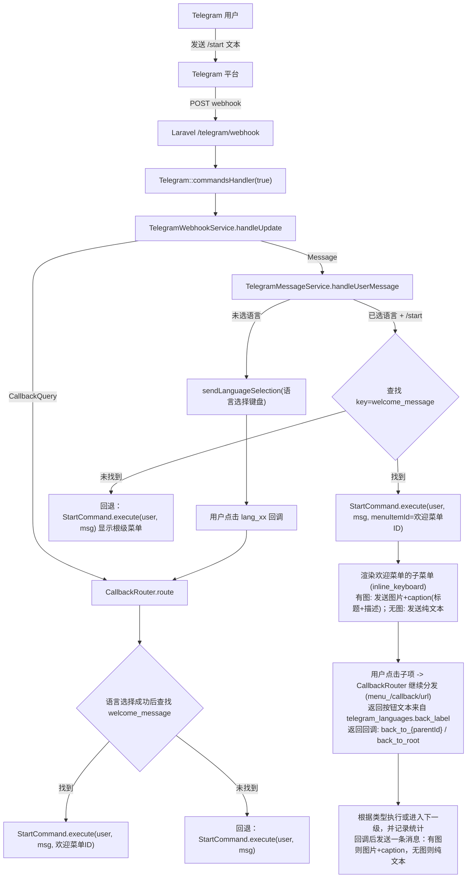
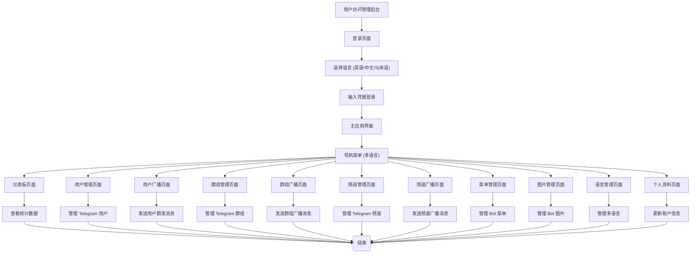
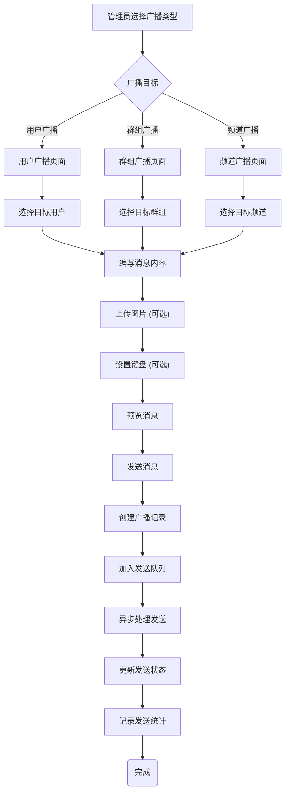

https://mermaid.live


```mermaid
graph TD;
    A["Telegram 用户"] -->|发送 /start 文本| B["Telegram 平台"];
    B -->|POST webhook| C["Laravel /telegram/webhook"];
    C --> D["Telegram::commandsHandler(true)"];
    D --> E["TelegramWebhookService.handleUpdate"];
    E -->|Message| F["TelegramMessageService.handleUserMessage"];
    E -->|CallbackQuery| R["CallbackRouter.route"];

    %% 文本 /start 的定向流程
    F -->|未选语言| G["sendLanguageSelection(语言选择键盘)"];
    F -->|已选语言 + /start| H{"查找 key=welcome_message"};
    H -- 找到 --> I["StartCommand.execute(user, msg, menuItemId=欢迎菜单ID)"];
    I --> J["渲染欢迎菜单的子菜单 (inline_keyboard)\n有图: 发送图片+caption(标题+描述)；无图: 发送纯文本"];
    H -- 未找到 --> K["回退：StartCommand.execute(user, msg) 显示根级菜单"];

    %% 语言选择成功后的首次展示
    G --> L["用户点击 lang_xx 回调"];
    L --> R;
    R --> M{"语言选择成功后查找 welcome_message"};
    M -- 找到 --> N["StartCommand.execute(user, msg, 欢迎菜单ID)"];
    M -- 未找到 --> O["回退：StartCommand.execute(user, msg)"];

    %% 子菜单浏览与返回
    J --> P["用户点击子项 -> CallbackRouter 继续分发 (menu_/callback/url)\n返回按钮文本来自 telegram_languages.back_label\n返回回调: back_to_{parentId} / back_to_root"];
    P --> Q["根据类型执行或进入下一级，并记录统计\n回调后发送一条消息：有图则图片+caption，无图则纯文本"];
```


```mermaid
graph TD;
    A["用户访问管理后台"] --> B["登录页面"];
    B --> C["选择语言 (英语/中文/马来语)"];
    C --> D["输入凭据登录"];
    D --> E["主应用界面"];
    E --> F["导航菜单 (多语言)"];
    F --> G["仪表板页面"];
    F --> H["用户管理页面"];
    F --> I["用户广播页面"];
    F --> J["群组管理页面"];
    F --> K["群组广播页面"];
    F --> L["频道管理页面"];
    F --> M["频道广播页面"];
    F --> N["菜单管理页面"];
    F --> O["图片管理页面"];
    F --> P["语言管理页面"];
    F --> Q["个人资料页面"];
    G --> R["查看统计数据"];
    H --> S["管理 Telegram 用户"];
    I --> T["发送用户群发消息"];
    J --> U["管理 Telegram 群组"];
    K --> V["发送群组广播消息"];
    L --> W["管理 Telegram 频道"];
    M --> X["发送频道广播消息"];
    N --> Y["管理 Bot 菜单"];
    O --> Z["管理 Bot 图片"];
    P --> AA["管理多语言"];
    Q --> BB["更新账户信息"];
    R --> CC("结束");
    S --> CC;
    T --> CC;
    U --> CC;
    V --> CC;
    W --> CC;
    X --> CC;
    Y --> CC;
    Z --> CC;
    AA --> CC;
    BB --> CC;
```


```mermaid
graph TD;
    A["管理员选择广播类型"] --> B{"广播目标"};
    B -- "用户广播" --> C["用户广播页面"];
    B -- "群组广播" --> D["群组广播页面"];
    B -- "频道广播" --> E["频道广播页面"];
    
    C --> F["选择目标用户"];
    D --> G["选择目标群组"];
    E --> H["选择目标频道"];
    
    F --> I["编写消息内容"];
    G --> I;
    H --> I;
    
    I --> J["上传图片 (可选)"];
    J --> K["设置键盘 (可选)"];
    K --> L["预览消息"];
    L --> M["发送消息"];
    
    M --> N["创建广播记录"];
    N --> O["加入发送队列"];
    O --> P["异步处理发送"];
    P --> Q["更新发送状态"];
    Q --> R["记录发送统计"];
    R --> S("完成");
```
```


