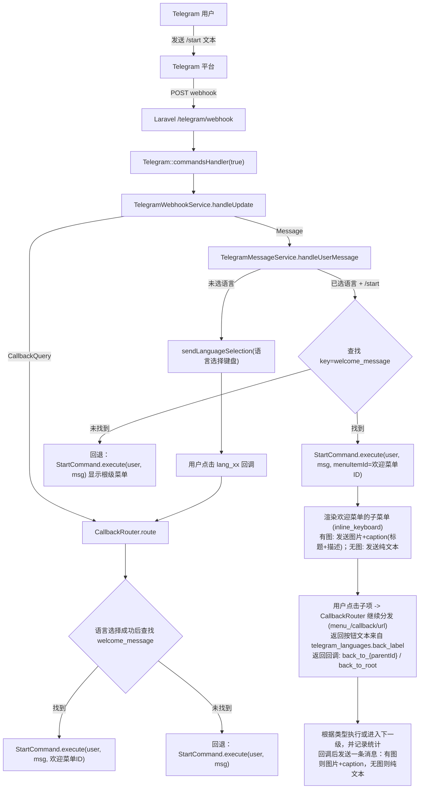

https://mermaid.live

```mermaid
graph TD;
    A["Telegram 用户"] -->|发送 /start 文本| B["Telegram 平台"];
    B -->|POST webhook| C["Laravel /telegram/webhook"];
    C --> D["Telegram::commandsHandler(true)"];
    D --> E["TelegramWebhookService.handleUpdate"];
    E -->|Message| F["TelegramMessageService.handleUserMessage"];
    E -->|CallbackQuery| R["CallbackRouter.route"];

    %% 文本 /start 的定向流程
    F -->|未选语言| G["sendLanguageSelection(语言选择键盘)"];
    F -->|已选语言 + /start| H{"查找 key=welcome_message"};
    H -- 找到 --> I["StartCommand.execute(user, msg, menuItemId=欢迎菜单ID)"];
    I --> J["渲染欢迎菜单的子菜单 (inline_keyboard)\n有图: 发送图片+caption(标题+描述)；无图: 发送纯文本"];
    H -- 未找到 --> K["回退：StartCommand.execute(user, msg) 显示根级菜单"];

    %% 语言选择成功后的首次展示
    G --> L["用户点击 lang_xx 回调"];
    L --> R;
    R --> M{"语言选择成功后查找 welcome_message"};
    M -- 找到 --> N["StartCommand.execute(user, msg, 欢迎菜单ID)"];
    M -- 未找到 --> O["回退：StartCommand.execute(user, msg)"];

    %% 子菜单浏览与返回
    J --> P["用户点击子项 -> CallbackRouter 继续分发 (menu_/callback/url)\n返回按钮文本来自 telegram_languages.back_label\n返回回调: back_to_{parentId} / back_to_root"];
    P --> Q["根据类型执行或进入下一级，并记录统计\n回调后发送一条消息：有图则图片+caption，无图则纯文本"];
```

